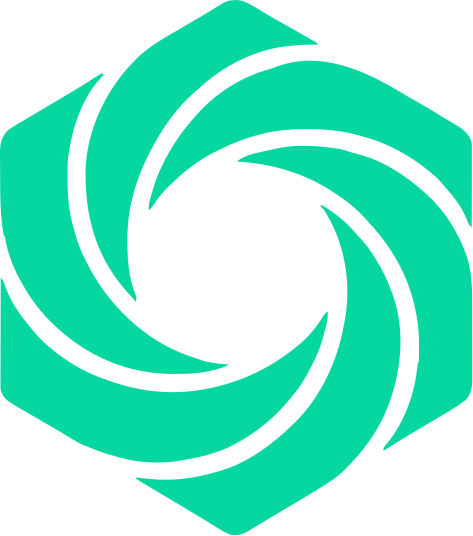
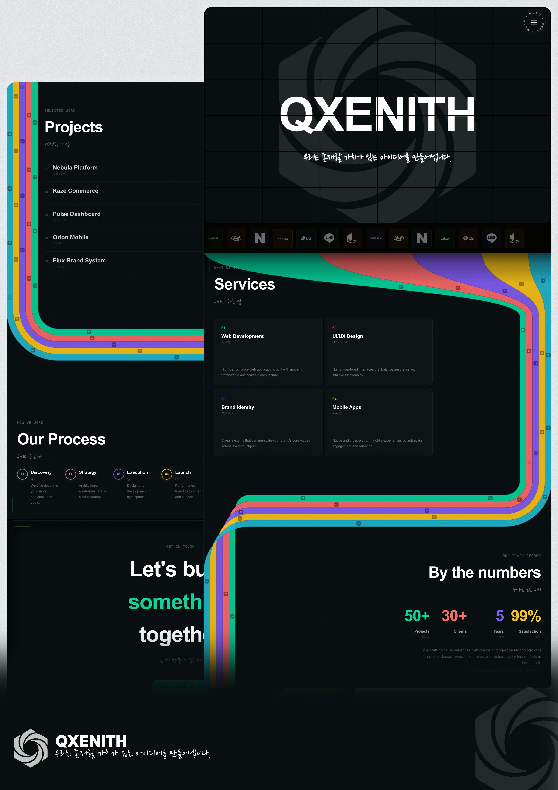
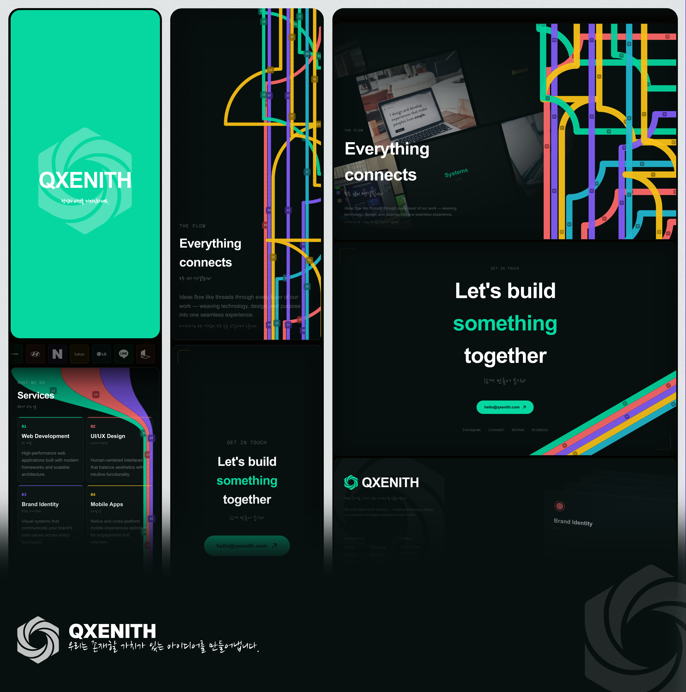

<div align="center">



# QXENITH

**We craft ideas worth existing.**

*우리는 존재할 가치가 있는 아이디어를 만들어냅니다.*

[](https://nextjs.org)
[](https://react.dev)
[](https://www.typescriptlang.org)
[](https://tailwindcss.com)
[](https://greensock.com/gsap)

</div>

---

## Preview

<div align="center">
  
  <br /><br />
  
</div>

---

## Overview

QXENITH is a digital studio building web applications, interfaces, brands, and mobile experiences that don't just work — they feel alive. This repository contains the studio's main website: a fully interactive, motion-driven site that pushes the boundaries of what a web presence can be.

The experience opens with an interactive **6×6 flip-card grid** that expands on scroll, revealing the full depth of the studio's work and philosophy across connected sections — orchestrated with precision animations, bilingual copy (English + Korean), and a cohesive dark design system.

---

## Features

- **Interactive hero grid** — 6×6 flip-card matrix with hover trails, ripple effects, and a scroll-triggered full-screen expansion
- **Morphing navigation** — Circular menu that transforms between a compact button and a full panel using GSAP timelines
- **Animated color bars** — 7 variants of SVG-based decorative elements (vertical, horizontal, diagonal, L-shape, Z-shape, cascade) with numbered badges moving along paths
- **Thread section** — Complex animated SVG paths connecting the page narrative, with a motion grid overlay of images and text
- **3D card carousel** — Elastic stacking card animation with configurable physics (distance, easing, skew)
- **Custom scroll cursor** — Cursor that adapts to the custom scroll container behavior
- **Company marquee** — Continuous scrolling client logo strip
- **Fully responsive** — Mobile-first layout using fluid `clamp()` typography and adaptive components at every breakpoint
- **Bilingual** — All copy in English with Korean 한국어 translations
- **Performance-first** — React Compiler enabled, `ResizeObserver`-based responsive components, zero layout shift

---

## Tech Stack

| Layer | Technology |
|---|---|
| Framework | [Next.js 16](https://nextjs.org) (App Router) |
| UI Library | [React 19](https://react.dev) |
| Language | [TypeScript 5](https://www.typescriptlang.org) |
| Styling | [Tailwind CSS v4](https://tailwindcss.com) |
| Animation | [GSAP 3.14](https://greensock.com/gsap) |
| Fonts | Geist Sans · Geist Mono · Nanum Brush Script |
| Compiler | React Compiler (experimental) |

---

## Getting Started

### Prerequisites

- Node.js 20+ or [Bun](https://bun.sh) (recommended)

### Installation

```bash
git clone https://github.com/qxenith/website.git
cd website
bun install
```

### Development

```bash
bun dev
# → http://localhost:3000
```

### Production

```bash
bun run build
bun start
```

---

## Project Structure

```
src/
├── app/
│   ├── layout.tsx            # Root layout — loads CircleMenu & fonts
│   ├── page.tsx              # Entry point — renders the main grid
│   ├── globals.css           # Global styles & keyframes
│   ├── fonts.ts              # Font configuration
│   ├── robots.ts             # SEO robots config
│   └── sitemap.ts            # Dynamic sitemap
│
├── components/
│   ├── CircleMenu.tsx        # Morphing circular navigation menu
│   ├── CardSwap.tsx          # 3D elastic card carousel
│   ├── CompanyMarquee.tsx    # Scrolling client logo strip
│   ├── ContactSection.tsx    # "Let's build something together" CTA
│   ├── Footer.tsx            # Footer with CardSwap + spinning circle
│   ├── ProcessSection.tsx    # 4-step workflow section
│   ├── ProjectsSection.tsx   # Portfolio project list
│   ├── ServicesSection.tsx   # 4-service grid
│   ├── ThirdSection.tsx      # Stats — "By the numbers"
│   ├── ThreadsSection.tsx    # Animated SVG thread paths + grid motion
│   ├── ScrollCursor.tsx      # Custom cursor for the scroll container
│   │
│   ├── grid/
│   │   ├── GridWithOverlay.tsx     # Main hero — 6×6 expandable grid
│   │   ├── FlipCard.tsx            # GSAP 3D flip card
│   │   ├── Overlay.tsx             # Mouse-tracking interaction layer
│   │   ├── SegmentedText.tsx       # Per-card viewport content slicing
│   │   ├── CardFace.tsx            # Front / back face wrapper
│   │   ├── GapTable6x6.tsx         # Grid gap alignment helper
│   │   ├── useGridSize.ts          # Responsive grid dimensions hook
│   │   └── useFlipTimer.ts         # Flip timing logic hook
│   │
│   └── color-bars/
│       ├── types.ts                # Shared color palette & speed constants
│       ├── VerticalBars.tsx        # Animated vertical bar columns
│       ├── HorizontalBars.tsx      # Animated horizontal bar rows
│       ├── DiagonalBars.tsx        # Tilted bar decoration
│       ├── LShapeBars.tsx          # L-shaped corner bars
│       ├── ZShapeBars.tsx          # Full-width Z-shaped bars (auto-sizing)
│       ├── CascadeVerticalBars.tsx # Cascading vertical variant
│       ├── useMarquee.ts           # Shared animation offset hook
│       └── useBarThickness.ts      # Viewport-aware bar thickness hook
│
└── public/
    └── logos/                      # SVG logos (brand + client companies)
```

---

## Design System

### Color Palette

| Name | Hex | Role |
|---|---|---|
| Mint | `#06D6A0` | Primary accent, CTAs |
| Coral | `#FF6B6B` | Secondary accent |
| Purple | `#845EF7` | Tertiary accent |
| Gold | `#FCC419` | Quaternary accent |
| Cyan | `#22B8CF` | Quinary accent |
| Surface | `#080F0F` | Cards & sections |
| Background | `#030301` | Page background |

### Typography

| Role | Font | Style |
|---|---|---|
| Headings | Geist Sans | `font-extrabold tracking-tight` |
| Body | Geist Sans | Regular |
| Labels / Numbers | Geist Mono | `font-mono` |
| Korean taglines | Nanum Brush Script | Brush script |

---

## Page Sections

| Anchor | Section | Description |
|---|---|---|
| `#home` | Hero Grid | Interactive 6×6 flip-card matrix |
| `#clients` | Clients | Scrolling company logo marquee |
| `#services` | Services | Web Dev · UI/UX · Brand · Mobile |
| `#about` | By the Numbers | 50+ Projects · 30+ Clients · 5 Years · 99% |
| `#projects` | Projects | Selected portfolio work |
| `#process` | Our Process | Discovery → Strategy → Execution → Launch |
| `#flow` | Threads | Animated connection paths |
| `#contact` | Contact | "Let's build something together" |
| `#footer` | Footer | Links · Social · Services showcase |

---

## Screenshot Tool

A standalone CLI tool lives at `../screenshots/script.js` for generating design-ready captures of every section.

```bash
cd ../screenshots
node script.js
```

The CLI will:
1. Ask for the target URL (defaults to `http://localhost:3000`)
2. Auto-discover all elements with IDs on the page
3. Let you select which sections to capture
4. Let you choose desktop (1440×900 @2x), mobile (390×844 @3x), or both

Outputs land in `screenshots/<hostname>/desktop/` and `screenshots/<hostname>/mobile/`.

---

## License

All rights reserved © 2026 QXENITH.
